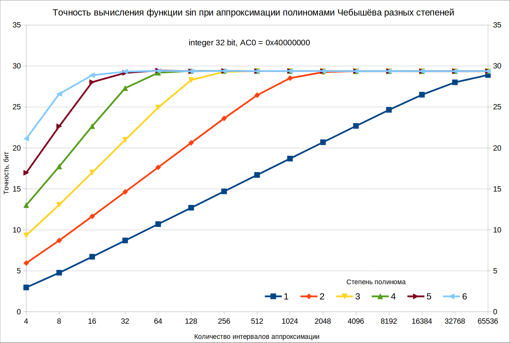
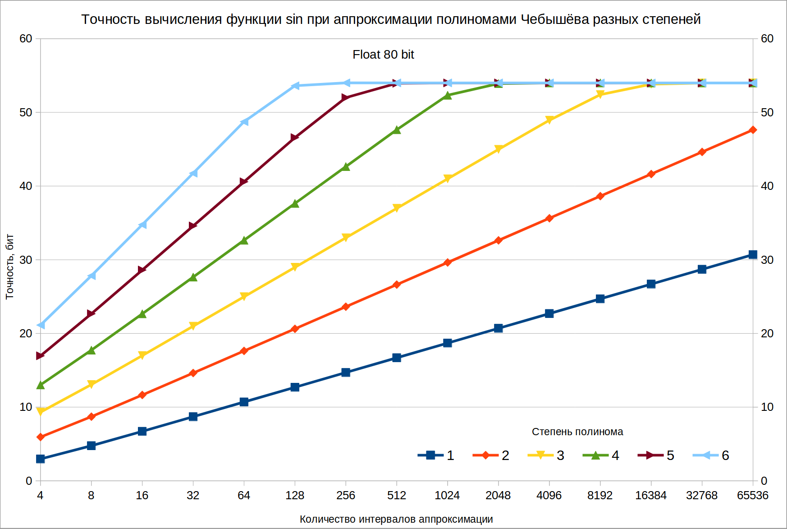

# sin_approx_04

Содержит несколько проектов, написанных на языке С. Цель их создания - реализовать быстрое вычисление тригонометрической функции `синуса` при помощи целочисленных 32-битных операций или операций с плавающей точкой. Точность вычислений [не превышает](#%D0%BF%D1%80%D0%BE%D0%B5%D0%BA%D1%82-accuracy_test) 30 бит для целых 32-битных чисел и 54 бит - для операций с плавающей точкой.
Для вычисления синуса период от 0° до 360° разбивается на несколько одинаковых интервалов, количеством равным степени двойки (4, 8, 16 и т.д.). Внутри каждого интервала искомое значение находится при помощи полинома заданной степени по [заранее посчитанным](#%D0%BF%D1%80%D0%BE%D0%B5%D0%BA%D1%82-table_make) коэффициентам.<br> 
Например, при степени полинома = 3, результат вычисляется по формуле
```
	sin() = A[3]·x³ + A[2]·x² + A[1]·x + A[0]
```
где:<br>
 **x** - позиция внутри интервала, в диапазоне 0.0 ≤ x < 1.0;<br>
 **A[3]** .. **A[0]** - заранее вычисленные коэффициенты для конкретного интервала.<br>
 
Количество интервалов и степень полинома подбираются исходя из необходимой точности вычислений. Точность выше 24 бит, к примеру, может быть получена полиномом 6-й степени при 8 интервалах разбиения, 3-й степени при 64 интервалах или 1-й степени при 8192 интервалах. Соотношение количества интервалов и степени полинома выбирается исходя из доступных ресурсов и необходимого быстродействия.<br>

#### Зависимость точности 32-битных целочисленных вычислений  от степени полинома и количества интервалов:


#### Зависимость точности 80-битных вычислений с плавающей точкой от степени полинома и количества интервалов:


Результатом вычисления является число либо с плавающей, либо с фиксированной точкой. Количество бит после фиксированной точки зависит от множителя **AC0**. Например, при AC0 = 0x40000000 результат следует интерпретировать как знаковое число с фиксированной точкой размерности ±1.30.<br>


## Проект `table_make`
Проект создан в *code::blocks 20.03*. Содержит бинарный файл для windows. Может быть скомпилирован при помощи GCC, для этого предназначен скрипт **compile.sh**.
Содержит генератор таблиц с коэффициентами полиномов от 1 до *теоретически любой* степени. Коэффициенты для каждого интервала вычисляются интерполяцией полиномами Чебышёва 1-го рода.<br>
Формат запуска:
```
sin_approx_04.exe <N> <PW> [AC0] [AC_shift] [DC]
```
где:<br>
**N** - количество интервалов, на которое разбивается период от 0° до 360° (обязательный параметр);<br>
**PW** - степень полинома (обязательный параметр);<br>
**AC0** - множитель при коэффициенте 0-й степени (0x40000000 по умолчанию)<br>
**AC_shift** - степень двойки, указывающая, во сколько раз будет больше множитель при коэффициенте следующей степени. При AC_shift = 3 каждая степень будет "весомее" предыдущей в 8 раз. (Необязательный, по умолчанию 0. Но для корректной работы примера на Cortex-M3 этот параметр должен быть не менее **1**);<br>
**DC** - сколько будет прибавляться к коэффициенту перед приведением к целому числу, для уменьшения ошибки округления (по умолчанию 0.5).<br>

Результат в виде исходного кода на языке С будет выведен на консоль. Для записи в файл его следует перенаправить при помощи **>**.<br>
Для получения файла с коэффициентами полинома 3-й степени на 64 интервалах следует выполнить:
```
sin_approx_04.exe 64 3 0x40000000LL 3 > ..\tables\sine_approx_64_3_3.c
```
Результат будет записан в файл \.\.**\tables\sine_approx_64_3_3.c**.

Cкрипт **make_tables.lua** создаёт:<br>
- набор таблиц с количеством интервалов от 4 до 65536 и степенью полинома - от 1 до 6, всего получается **90** таблиц.<br>
- вспомогательные файлы, которые необходимы для проверки точности вычислений **accuracy_test**.<br>

## Проект `accuracy_test`
Проект создан в *code::blocks 20.03*. Не содержит бинарных файлов в виду их большого размера. На практике проверять ничего не надо - для наиболее интересных случаев это уже сделано. Но если желание проверить всё-таки есть - можно собрать бинарные файлы либо в code::blocks, либо при помощи скрипта **compile**. Перед компиляцией проекта необходимо запустить скрипт **make_tables.lua** из проекта **table_make**, который создаст необходимые доп. исходные файлы, а затем запустить там же скрипт **make_tables.cmd**, который создаст полный набор таблиц с коэффициентами.<br>
Проект предназначен для проверки точности вычислений функции синуса с разными параметрами. <br>
Проверка производится для заданной таблицы коэффициентов, при этом последовательно перебираются аргументы от 0 до 2^32 - 1, всего 4294967296. В качестве эталона для сравнения использована стандартная функция `sinl()`. Результат каждой аппроксимации сравнивается с ней, и по итогам находится самая большая разница между ними - это считается худшим случаем. Худший случай, нормированный к ±1 и выраженный в виде степени двойки, записывается в файлы в папке **/result**:<br>
**bit_accuracy_xxxx.log** - файл с результатами проверки для каждой таблицы коэффициентов;<br>
**bit_accuracy_xxxx.csv** - сводная таблица с точностью вычислений для всех таблиц коэффициентов.<br>

В папке **result** уже содержатся результаты проверок с наиболее интересными параметрами. Для наглядности они оформлены в виде электронных таблиц с диаграмами в формате .ods (Open office / Libre office). Так же суммарно все все результаты сведены в двет таблицы **[bit_accuracy_FLOAT_ALL.ods](/accuracy_test/result/bit_accuracy_FLOAT_ALL.ods)** и **[bit_accuracy_INT32_ALL.ods](/accuracy_test/result/bit_accuracy_INT32_ALL.ods)**, в них результаты по каждому типу оформлены в виде своих вкладок.<br>
Большая часть диаграмм сохранена в виде изображений в формате png.<br>
Вычисление 4294967296 аргументов занимает некоторое время:<br>
- примерно 6 минут на Intel Core i7-4500 1.8GHz с Winдows;<br>
- примерно 25 минут на Allwinner A20 с Armbian linux.<br>

Может быть запущено несколько экземпляров программы, каждая из которых будет проверять свой набор таблиц, файл **run3.cmd** является примером такого запуска.
 
## Примеры использования `example`
В этой папке находится 2 проекта:<br>
- для **ПК**;<br>
- для **ARM Cortex-M3** на примере STM32F103C8T.
### Проект `example\PC`
Содержит пример вызова функции **get_sine_int32**.<br>
Бинарные файлы могут быть собраны при помощи скриптов **compile.sh** и **compile.cmd**.

### Проект `example\STM32`
Содержит проект, созданный в EmBitz 1.11 для МК STM32F103C8T.<br>
Функции вычисления синуса при полиномов разных степеней (от 1 до 6), оформлены в виде ассемблерных вставкок в файле **src\main.c**. В кооментариях к каждой вставке есть, в т.ч., результаты измерения быстродействия.
В качестве аргумента используются угол от 0° до 360°, выраженный в виде целого числа от 0 до 2^32 - 1.<br>
Важное замечание для этого проекта:<br>
таблица коэффициентов должна быть создана программой **sin_approx_04.exe** с параметром **AC_shift** больше **0**. В примере использован набор готовых таблиц.
## Папка `tables`
В этой папке содержатся файлы, необходимые для проектов **example\PC**, **example\STM32** и **accuracy_test**. В эту папку создаются таблицы коэффициентов при помощи скрипта **table_make\make_tables.cmd**.

---

## Условия использования
Этот программный продукт может быть использован на условиях лицензии BSD:

**BSD License**
Copyright (c) 2021, Victor Agarkov <victoragarkov@gmail.com>. All rights reserved.
Redistribution and use in source and binary forms, with or without modification, are permitted provided that the following conditions are met:
1. Redistributions of source code must retain the above copyright notice, this list of conditions and the following disclaimer.
2. Redistributions in binary form must reproduce the above copyright notice, this list of conditions and the following disclaimer in the documentation and/or other materials provided with the distribution.
3. All advertising materials mentioning features or use of this software must display the following acknowledgement: This product includes software developed by the Victor Agarkov.
4. Neither the name of the Victor Agarkov nor the names of its contributors may be used to endorse or promote products derived from this software without specific prior written permission.

THIS SOFTWARE IS PROVIDED BY Victor Agarkov AS IS AND ANY EXPRESS OR IMPLIED WARRANTIES, INCLUDING, BUT NOT LIMITED TO, THE IMPLIED WARRANTIES OF MERCHANTABILITY AND FITNESS FOR A PARTICULAR PURPOSE ARE DISCLAIMED. IN NO EVENT SHALL Victor Agarkov BE LIABLE FOR ANY DIRECT, INDIRECT, INCIDENTAL, SPECIAL, EXEMPLARY, OR CONSEQUENTIAL DAMAGES (INCLUDING, BUT NOT LIMITED TO, PROCUREMENT OF SUBSTITUTE GOODS OR SERVICES; LOSS OF USE, DATA, OR PROFITS; OR BUSINESS INTERRUPTION) HOWEVER CAUSED AND ON ANY THEORY OF LIABILITY, WHETHER IN CONTRACT, STRICT LIABILITY, OR TORT (INCLUDING NEGLIGENCE OR OTHERWISE) ARISING IN ANY WAY OUT OF THE USE OF THIS SOFTWARE, EVEN IF ADVISED OF THE POSSIBILITY OF SUCH DAMAGE. 

